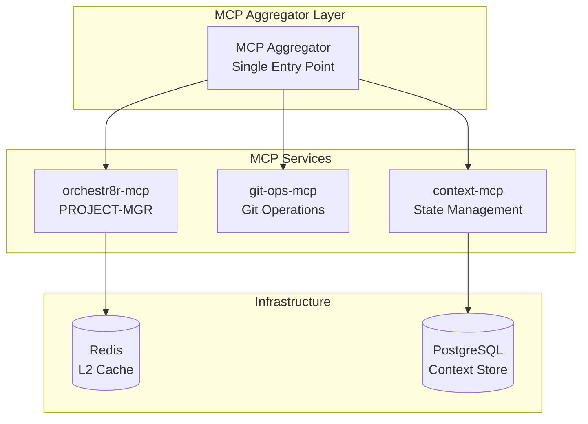

# Architecture Alignment Recommendations for orchestr8r-mcp

## Executive Summary

Your research document presents excellent MCP ecosystem best practices that align perfectly with orchestr8r-mcp's evolution. This analysis provides concrete recommendations for implementing these patterns while maintaining our vision of orchestr8r-mcp as the PROJECT-MGR foundation in the larger AODL system.

## Key Alignment Points

### 1. orchestr8r-mcp as a Focused MCP Server

Your research validates our approach:
- **Keep orchestr8r-mcp focused** on GitHub Projects V2 operations
- **Build new services alongside** (Git Ops, Context Store) as separate MCP servers
- **Use the Aggregator Pattern** to coordinate multiple servers

This aligns perfectly with the MCP principle: "simplicity in server construction, composability for combining focused functionality."

### 2. Immediate TypeScript SDK Migration

Your research strongly recommends the high-level McpServer pattern. Let's refactor orchestr8r-mcp:

```typescript
// Current approach (index.ts - 771 lines)
server.tool(
  toolName as any,
  schema as any,
  async (args: unknown) => { /* ... */ }
);

// Recommended approach
import { McpServer } from "@modelcontextprotocol/sdk/server/mcp.js";

const server = new McpServer({ 
  name: "orchestr8r-mcp", 
  version: "2.0.0" 
});

// Clean, type-safe tool registration
server.tool("get-project", 
  { id: z.string().describe("GitHub Project ID") }, 
  async ({ id }) => projectOps.getProject(id)
);
```

### 3. Plugin Architecture for Modularization

Transform our monolithic structure into plugins:

```typescript
// src/plugins/projects/index.ts
export class ProjectsPlugin implements MCPPlugin {
  name = "projects";
  
  tools = [
    { name: "get-project", handler: this.getProject },
    { name: "create-project", handler: this.createProject },
    // ... 15 more project tools
  ];
  
  resources = [
    { uri: "projects://{projectId}", handler: this.getProjectResource }
  ];
}

// src/index.ts (reduced to ~50 lines)
const server = new MCPServer({ name: "orchestr8r-mcp" });
server.registerPlugin(new ProjectsPlugin());
server.registerPlugin(new IssuesPlugin());
server.registerPlugin(new WorkflowPlugin()); // New!
```

## Concrete Implementation Roadmap

### Phase 1: Foundation Refactoring (Sprint 1 - Current Items)

Based on Project 10's current sprint:

1. **"Implement morning standup automation" (In Progress, 5pts)**
   - Complete current implementation
   - Add circuit breaker pattern for GitHub API calls
   - Implement structured logging

2. **"Create Git hooks for status sync" (Todo, 8pts)**
   - Design as separate `git-ops-mcp` server
   - Use event-driven architecture from research
   - Implement with TypeScript SDK pattern

3. **"Build sprint velocity dashboard" (Todo, 13pts)**
   - Implement caching layer first (L1 in-memory, L2 Redis)
   - Add resource templates for dynamic dashboards
   - Use aggregator pattern to combine data sources

### Phase 2: Modularization Sprint (New Items for Sprint 2)

Transform these into real GitHub issues:

```typescript
// Draft issues to convert and add to Project 10
const sprint2Items = [
  {
    title: "Migrate to TypeScript SDK McpServer pattern",
    body: "Refactor index.ts to use high-level SDK pattern",
    priority: "Critical",
    storyPoints: 8,
    labels: ["refactoring", "architecture"]
  },
  {
    title: "Implement plugin architecture",
    body: "Create plugin system and refactor tools into plugins",
    priority: "High",
    storyPoints: 13,
    labels: ["architecture", "modularization"]
  },
  {
    title: "Add multi-level caching with Redis",
    body: "Implement L1/L2 cache pattern from research",
    priority: "High",
    storyPoints: 8,
    labels: ["performance", "infrastructure"]
  },
  {
    title: "Create MCPAggregator for multi-server coordination",
    body: "Implement aggregator pattern for future services",
    priority: "Medium",
    storyPoints: 13,
    labels: ["architecture", "scalability"]
  }
];
```

### Phase 3: Production Hardening (Sprint 3)

Based on research recommendations:

1. **Containerization**
   ```yaml
   # docker-compose.yml
   services:
     orchestr8r-mcp:
       build: .
       environment:
         - GITHUB_TOKEN
       healthcheck:
         test: ["CMD", "curl", "-f", "http://localhost:8080/health"]
         
     redis:
       image: redis:7-alpine
       volumes:
         - redis-data:/data
   ```

2. **Monitoring & Observability**
   - Implement Winston logging with correlation IDs
   - Add Prometheus metrics
   - Create Grafana dashboards

3. **Security Implementation**
   - OAuth 2.1 with PKCE (as shown in research)
   - API key rotation mechanism
   - Audit logging for all mutations

## Architectural Decisions

### 1. Service Boundaries

Based on your research and our IDEATION vision:



### 2. State Management Strategy

Implement the Context Package Pattern from your research:

```typescript
interface WorkflowContext {
  sessionId: string;
  userId: string;
  currentSprint: string;
  focusItem?: string;
  preferences: UserPreferences;
}

class DistributedContextStore {
  async getCurrentContext(userId: string): Promise<WorkflowContext> {
    // Implementation using Redis as shown in research
  }
}
```

### 3. Transaction Handling

Use Saga Pattern for distributed operations:

```typescript
class SprintCreationSaga {
  async execute(params: CreateSprintParams) {
    const steps = [
      { service: 'orchestr8r', action: 'createProject' },
      { service: 'orchestr8r', action: 'addIterationField' },
      { service: 'git-ops', action: 'createBranch' },
      { service: 'context', action: 'saveSprintContext' }
    ];
    
    // Execute with compensating actions
  }
}
```

## Sprint Planning Recommendations

### Convert Current Draft Issues to Real Issues

```bash
# Use orchestr8r-mcp to convert drafts
for item in sprint1Items:
  - Convert to real issue in orchestr8r-mcp repo
  - Link to Project 10
  - Maintain priority and story points
```

### New Issues for Architecture Alignment

Create these issues in priority order:

1. **Critical Priority**
   - TypeScript SDK migration (8pts)
   - Plugin architecture (13pts)
   - Error handling with circuit breakers (5pts)

2. **High Priority**
   - Multi-level caching (8pts)
   - Docker containerization (5pts)
   - Structured logging (3pts)

3. **Medium Priority**
   - MCP Aggregator implementation (13pts)
   - Monitoring setup (8pts)
   - Integration tests (8pts)

### Sprint Timeline

**Sprint 1 (Current)**: Complete existing items + foundation
**Sprint 2 (Weeks 3-4)**: Modularization and caching
**Sprint 3 (Weeks 5-6)**: Production hardening
**Sprint 4 (Weeks 7-8)**: Multi-server orchestration
**Sprint 5 (Weeks 9-10)**: Performance optimization

## Key Recommendations

### 1. Start with High-Impact, Low-Risk Changes
- TypeScript SDK migration can be incremental
- Add caching without changing external APIs
- Implement logging/monitoring early

### 2. Maintain Backward Compatibility
- Keep existing tool names and schemas
- Version the API when breaking changes needed
- Provide migration guides

### 3. Focus on Developer Experience
- Improve error messages using research patterns
- Add comprehensive health checks
- Create development mode with hot-reloading

### 4. Security from Day One
- Implement API key management immediately
- Add rate limiting to prevent abuse
- Use structured logging for audit trails

## Success Metrics

Track these KPIs:
1. **Performance**: API response time <200ms (p95)
2. **Reliability**: 99.9% uptime for core operations
3. **Scalability**: Support 1000+ concurrent connections
4. **Developer Velocity**: 50% reduction in setup time

## Next Actions

1. **Today**: 
   - Review and approve this alignment document
   - Convert draft issues to real issues
   - Start TypeScript SDK migration spike

2. **This Week**:
   - Complete Sprint 1 items
   - Plan Sprint 2 with new architecture items
   - Set up Redis for caching

3. **This Sprint**:
   - Deliver working plugin architecture
   - Implement basic caching
   - Add health checks and monitoring

Your research provides an excellent blueprint. The key is to implement incrementally while maintaining orchestr8r-mcp's stability as the PROJECT-MGR foundation of our larger system.