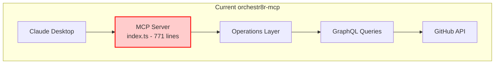
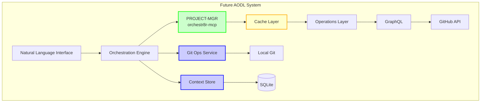
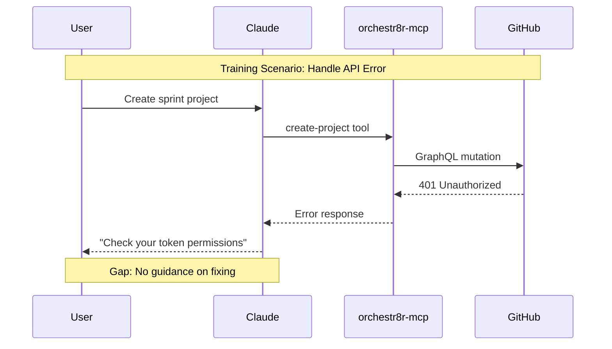

# orchestr8r-mcp Gaps Analysis: Missing Implementation Items

## Overview

This document provides a comprehensive analysis of gaps identified during our architectural review and planning sessions. It serves as a framework for future development work and project coordination.

## Architecture Diagram: Current vs. Target State

### Current State


### Target State (IDEATION Vision)


## Part 1: Training Implementation Gaps

### Question: What's Missing from Our Training Plan?

The training modules exist on paper, but lack:

1. **Interactive Sandbox Environment**
   - Need: Dedicated test GitHub organization
   - Gap: No automated setup script
   - Impact: Users practice on production data

2. **Expected Outputs Documentation**
   - Need: JSON response examples for each command
   - Gap: No reference outputs in training
   - Impact: Users unsure if commands succeeded

3. **Error Scenario Training**
   - Need: Common error patterns and fixes
   - Gap: No troubleshooting exercises
   - Impact: Users stuck when things fail

### Implementation Path


## Part 2: Architectural Recursive Review Gaps

### Question: How Do Services Actually Communicate?

Current understanding is incomplete:

1. **Service Discovery**
   ```typescript
   // Current: Direct instantiation
   const projectOps = new ProjectOperations(client);
   
   // Gap: How will services find each other?
   // Option 1: Service Registry
   const projectOps = await registry.getService('project-mgr');
   
   // Option 2: Environment Config
   const projectOps = new ProjectOperations(
     process.env.PROJECT_MGR_URL
   );
   ```

2. **Transaction Boundaries**
   - Question: What happens when Git commits but GitHub update fails?
   - Current: No transaction support
   - Need: Saga pattern or compensating transactions

3. **Authentication Flow**
   ```mermaid
   sequenceDiagram
       participant CLI as CLI
       participant ORCH as Orchestration
       participant PMGR as PROJECT-MGR
       participant GIT as Git Ops
       
       Note over CLI,GIT: Where does auth happen?
       CLI->>ORCH: Command + Token?
       ORCH->>PMGR: Forward token?
       ORCH->>GIT: Different auth?
       
       Note over ORCH: Gap: Auth strategy undefined
   ```

## Part 3: PROJECT-MGR Integration Gaps

### Question: How Do We Extend Without Breaking?

The IDEATION document proposes extensions to orchestr8r-mcp:

```typescript
// Proposed WorkflowOperations
interface WorkflowOperations {
  getCurrentSprint(): Promise<Sprint>
  getSprintProgress(): Promise<SprintProgress>
  getNextRecommendedTask(developerId: string): Promise<Issue>
}
```

### Implementation Challenges:

1. **getCurrentSprint() - No Sprint Concept**
   ```typescript
   // Current: Must compose from primitives
   async getCurrentSprint(projectId: string): Promise<Sprint> {
     // 1. Get iteration field
     const fields = await this.getProjectFields(projectId);
     const iterationField = fields.find(f => f.dataType === 'ITERATION');
     
     // 2. Find current iteration - HOW?
     // Gap: No API to get "current" iteration
     // Must calculate based on dates
     
     // 3. Get items in iteration
     // Gap: No filter for current iteration
     // Must get ALL items and filter client-side
   }
   ```

2. **getNextRecommendedTask() - No Intelligence Layer**
   - Current: Can get items by priority
   - Gap: No user assignment history
   - Gap: No velocity tracking
   - Gap: No skill matching

### Data Flow Uncertainty
```mermaid
graph LR
    subgraph "Unclear Data Flow"
        CLI[CLI] -->|"1. 'Start my day'"| ORCH[Orchestration]
        ORCH -->|"2. ???"| PMGR[PROJECT-MGR]
        ORCH -->|"3. ???"| GIT[Git Ops]
        ORCH -->|"4. ???"| CTX[Context]
        
        PMGR -->|"5. Sprint data"| ORCH
        GIT -->|"6. Branch created"| ORCH
        CTX -->|"7. User prefs"| ORCH
        
        ORCH -->|"8. Combined response"| CLI
    end
    
    Note over ORCH: Gap: Coordination logic undefined
```

## Part 4: Testing Strategy Gaps

### Question: How Do We Test Multi-Service Flows?

Current test attempts revealed:

1. **Mock Complexity**
   ```typescript
   // Attempted: Mock GitHub client
   class MockGitHubClient {
     async graphql() { /* ... */ }
   }
   
   // Reality: Operations import queries directly
   import { getProject } from '../graphql/projects';
   
   // Gap: Can't intercept query loading
   // Need: Dependency injection
   ```

2. **Integration Test Infrastructure**
   - No docker-compose for test environment
   - No fixture data strategy
   - No service isolation approach

## Part 5: Performance & Scaling Gaps

### Question: What Happens at Scale?

Unaddressed concerns:

1. **Cache Invalidation**
   ```typescript
   // Simple cache proposed
   class QueryCache {
     get<T>(key: string, fetcher: () => Promise<T>): Promise<T>
   }
   
   // But: When to invalidate?
   // - After mutations?
   // - Time-based?
   // - Event-driven?
   ```

2. **Bulk Operation Limits**
   - Current: Sequential processing
   - GitHub GraphQL: Node limit per query
   - Gap: No batching strategy

## Part 6: Deployment & Operations Gaps

### Question: How Do We Run This in Production?

Missing pieces:

1. **Configuration Management**
   ```yaml
   # Where does this live?
   orchestr8r:
     services:
       project-mgr:
         url: "stdio://./project-mgr"
       git-ops:
         url: "http://localhost:8081"
       context:
         url: "sqlite:///var/orchestr8r/context.db"
   ```

2. **Observability**
   - No metrics collection
   - No distributed tracing
   - No health checks
   - No SLI/SLO definitions

## Reflection: The Socratic Method

Let's think about these gaps:

### 1. **Why wasn't caching implemented initially?**

Consider the operations:
- `createProject` - Modifies data
- `updateField` - Modifies data
- `getProject` - Reads data (cacheable?)

**Insight**: Most operations are mutations. Caching adds complexity for little benefit in write-heavy workloads.

**Better Question**: Should we cache at the query level or result level?

### 2. **Why are error types unused?**

Look at where errors occur:
```typescript
try {
  const result = await this.octokit.graphql(query);
  return result;
} catch (error) {
  console.error('GraphQL request failed:', error);
  throw error;  // Original error, not custom type
}
```

**Insight**: MCP has its own error model. Custom errors might not serialize properly over stdio transport.

**Better Question**: How do MCP errors map to our domain errors?

### 3. **Why is index.ts monolithic?**

Registration requires:
1. Tool name
2. Schema
3. Handler function
4. All in one place for MCP server

**Insight**: MCP's design encourages centralized registration.

**Better Question**: How can we modularize while keeping registration central?

## Action Items by Priority

### Critical (Sprint 1)
1. **Implement Dependency Injection**
   ```typescript
   // Enable testing and modularity
   interface ServiceContainer {
     register<T>(name: string, factory: () => T): void
     resolve<T>(name: string): T
   }
   ```

2. **Create Integration Test Harness**
   ```yaml
   # docker-compose.test.yml
   services:
     mock-github:
       image: mockserver/mockserver
       environment:
         MOCKSERVER_INITIALIZATION_JSON_PATH: /fixtures
   ```

### Important (Sprint 2)
1. **Design Cache Strategy**
   - Read-through cache for queries
   - Write-through for mutations
   - Event-based invalidation

2. **Implement Workflow APIs**
   - Start with getCurrentSprint()
   - Build on existing primitives
   - Add telemetry

### Nice to Have (Sprint 3+)
1. **Service Mesh Considerations**
   - Health checks
   - Circuit breakers
   - Retry policies

2. **Monitoring Stack**
   - Prometheus metrics
   - Jaeger tracing
   - Grafana dashboards

## Summary

This gaps analysis reveals that while orchestr8r-mcp has a solid foundation, significant work remains to achieve the AODL vision. The key insight is that orchestr8r-mcp should remain focused as the PROJECT-MGR component, with new services built alongside rather than modifying its core.

The path forward requires:
1. Better testing infrastructure
2. Service coordination patterns
3. Caching and performance optimization
4. Operational readiness

Each gap represents an opportunity to build a more robust, scalable system while maintaining the simplicity that makes orchestr8r-mcp effective today.