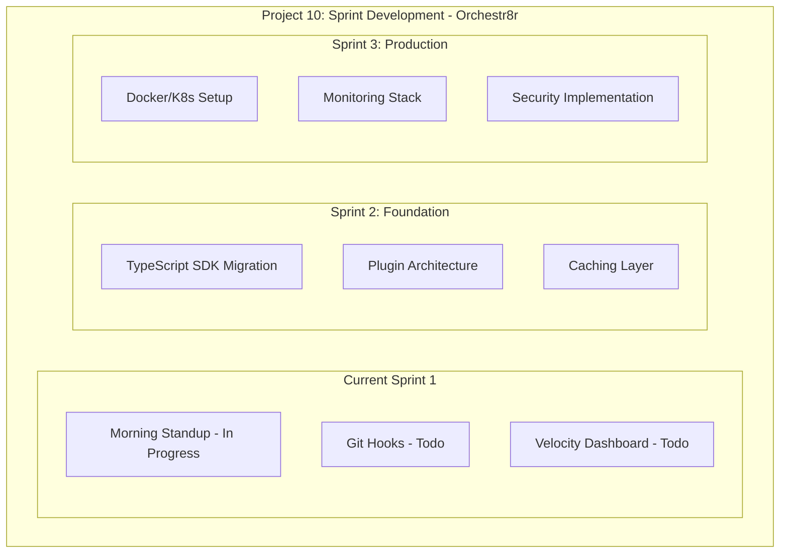
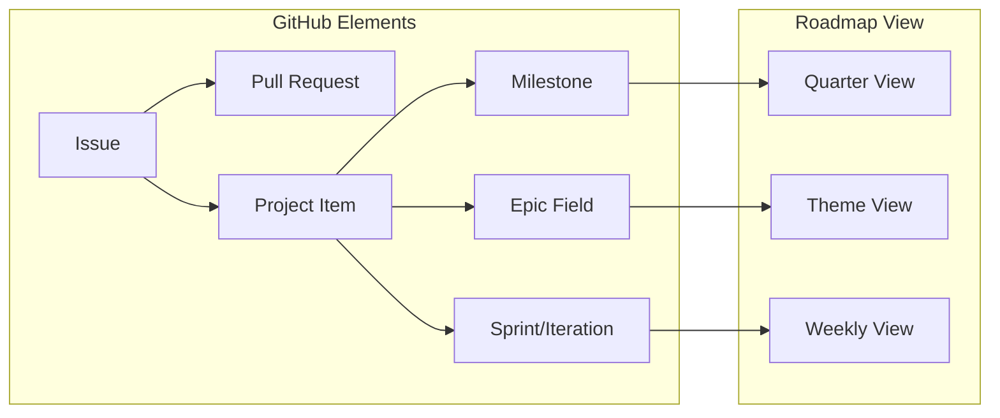

# Project 10 Roadmap Strategy: From Current State to AODL Vision

## Understanding GitHub Projects for Roadmapping

### GitHub Projects Roadmap Components

1. **Milestones** = Major Releases or Phases
2. **Iterations/Sprints** = Time-boxed work periods  
3. **Epics** = Large features (use labels or custom field)
4. **Issues** = Actual work items
5. **Views** = Different perspectives on the same data

### Recommended Project 10 Structure



## 1. Current Documentation Needs

### Immediate Documentation Priorities

Based on existing functionality, create these documents:

#### A. API Reference (Critical)
```markdown
# orchestr8r-mcp API Reference

## Project Tools

### get-project
Retrieves a GitHub Project by ID.

**Parameters:**
- `id` (string, required): GitHub Project node ID

**Returns:**
- Project object with title, description, URL, status

**Example:**
```typescript
await orchestr8r.getProject("PVT_kwHOAALNNc4A5x3U")
```

[Document all 29 tools similarly]
```

#### B. Quick Start Guide
```markdown
# orchestr8r-mcp Quick Start

## 5-Minute Setup

1. Install via Smithery:
   ```bash
   npx @smithery/cli install orchestr8r-mcp
   ```

2. Configure your token:
   ```bash
   export GITHUB_TOKEN=ghp_yourtoken
   export GITHUB_OWNER=yourusername
   ```

3. Test your connection:
   ```
   User: "List my projects"
   Claude: [Shows your GitHub projects]
   ```

## Your First Automation
[Walk through morning standup example]
```

## 2. Product Planning & GitHub Project Mapping

### Transform Project 10 into a Proper Roadmap

#### Step 1: Add Epic Field
```typescript
// Add custom field for epics
const epicField = {
  name: "Epic",
  dataType: "SINGLE_SELECT",
  options: [
    { name: "Foundation", color: "BLUE" },
    { name: "Modularization", color: "GREEN" },
    { name: "Production", color: "ORANGE" },
    { name: "Intelligence", color: "PURPLE" }
  ]
};
```

#### Step 2: Create Milestone Labels
```typescript
const milestones = [
  "v2.0 - TypeScript SDK",
  "v2.1 - Plugin Architecture", 
  "v3.0 - Multi-Server",
  "v4.0 - AODL Complete"
];
```

#### Step 3: Issue Templates
```yaml
# .github/ISSUE_TEMPLATE/architecture-task.yml
name: Architecture Task
description: Task for architecture improvements
labels: ["architecture"]
body:
  - type: dropdown
    id: epic
    attributes:
      label: Epic
      options:
        - Foundation
        - Modularization
        - Production
        - Intelligence
```

### Mapping Strategy



## 3. Documentation Reorganization Plan

### Phase 1: Consolidate Current Docs (This Sprint)

1. **Create Standard Structure**
   ```bash
   mkdir -p docs/{getting-started,guides,reference,development}
   ```

2. **Move and Merge**
   - `README.md` → Keep at root (simplified)
   - `DEBUGGING.md` → `docs/guides/debugging.md`
   - `focus-demo.md` → `docs/examples/morning-standup.md`
   - `PINNED.md` → Split into multiple guides

3. **Create New Core Docs**
   - `docs/reference/tools/` - API documentation
   - `docs/getting-started/tutorial.md` - Hands-on guide
   - `CONTRIBUTING.md` - Contribution guidelines

### Phase 2: Planning Documents (Sprint 2)

1. **Active Planning** stays in `PLANNING/`
   - Current sprint plans
   - Architecture proposals
   - Research documents

2. **Completed Plans** → `PLANNING/archive/`
   - Implemented designs
   - Obsolete proposals

3. **Product Roadmap** → `docs/development/roadmap.md`
   - Public-facing roadmap
   - Milestone descriptions
   - Vision alignment

## 4. Populating Project 10

### Sprint 1 Completion (Current)
```typescript
// Convert draft issues to real issues
const sprint1Issues = [
  {
    title: "Implement morning standup automation",
    body: readFromFile("docs/guides/morning-standup.md"),
    milestone: "v1.1",
    epic: "Foundation",
    sprint: "Sprint 1"
  },
  // ... other current items
];
```

### Sprint 2 Population (Architecture)
```typescript
const sprint2Issues = [
  {
    title: "Migrate to TypeScript SDK McpServer pattern",
    body: `## Objective
    Refactor index.ts from 771 lines to ~100 using SDK patterns
    
    ## Acceptance Criteria
    - [ ] All tools use declarative registration
    - [ ] Type safety improved
    - [ ] Tests passing
    
    ## References
    - [Architecture Research](./PLANNING/update-architecture-research.md)
    - [SDK Documentation](https://sdk.mcp.run)`,
    priority: "Critical",
    storyPoints: 8,
    epic: "Modularization"
  },
  {
    title: "Implement plugin architecture",
    body: `## Objective
    Break monolithic structure into domain plugins
    
    ## Design
    \`\`\`typescript
    interface MCPPlugin {
      name: string;
      tools: Tool[];
      resources: Resource[];
      prompts: Prompt[];
    }
    \`\`\``,
    priority: "High",
    storyPoints: 13,
    epic: "Modularization"
  },
  // ... more issues from research
];
```

### Sprint 3 Population (Production)
Based on your research document's Phase 3 recommendations.

## 5. GitHub Project Views Configuration

### View 1: Sprint Board (Default)
- **Grouping**: Status (Todo, In Progress, Done)
- **Sorting**: Priority desc, Story Points desc
- **Filters**: Current sprint only

### View 2: Roadmap View
- **Layout**: Table
- **Grouping**: Epic
- **Columns**: Title, Status, Sprint, Milestone, Assignee
- **Sorting**: Epic, Priority

### View 3: Architecture Focus
- **Filters**: Label contains "architecture"
- **Grouping**: Epic
- **Shows**: Dependencies, blockers

## Implementation Commands

```bash
# 1. Add Epic field to Project 10
orchestr8r create-project-field \
  --project-id PVT_kwHOAALNNc4A5x3U \
  --name "Epic" \
  --type SINGLE_SELECT \
  --options "Foundation,Modularization,Production,Intelligence"

# 2. Convert draft issues to real issues
for issue in $(orchestr8r get-project-items); do
  orchestr8r convert-draft-issue --item-id $issue
done

# 3. Create sprint 2 items
orchestr8r create-issue \
  --repo orchestr8r-mcp \
  --title "Migrate to TypeScript SDK" \
  --labels "architecture,sprint-2" \
  --project 10
```

## Success Metrics

1. **Documentation Coverage**: 100% of tools documented
2. **Sprint Velocity**: Track points completed per sprint
3. **Architecture Debt**: Reduce index.ts from 771 to <100 lines
4. **Test Coverage**: Achieve 80% coverage

## Next Actions

1. **Today**:
   - Add Epic field to Project 10
   - Create documentation structure
   - Convert first draft issue to real issue

2. **This Week**:
   - Complete Sprint 1 items
   - Write API reference for all tools
   - Plan Sprint 2 with architecture items

3. **This Month**:
   - Implement TypeScript SDK migration
   - Launch plugin architecture
   - Deploy first production version

This strategy aligns your excellent research with practical GitHub Projects usage while maintaining focus on the AODL vision.