# Architectural Decision Record: Persistent Context Tracker v1.0

**Status**: Proposed  
**Date**: 2025-01-31  
**Authors**: Development Team  
**Reviewers**: Architecture Team  

## Executive Summary

### Core Value Proposition

The Persistent Context Tracker introduces **stateful workflow awareness** to orchestr8r-mcp, transforming it from a collection of stateless tools into an intelligent development companion that maintains persistent awareness of the developer's current working context. This enhancement enables "invisible SCRUM" automation where project management happens naturally as a byproduct of development work.

### Strategic Alignment with AODL Vision

This proposal directly advances the AI-Orchestrated Development Lifecycle (AODL) vision by:

- **Enabling Context-Aware Automation**: Natural language commands become more reliable when the system knows what you're working on
- **Bridging Conversation ↔ SCRUM Gap**: Conversation management integration becomes seamless with persistent context
- **Accelerating v3.0 Multi-Service Architecture**: Provides the foundation for the planned Context Store MCP service
- **Supporting v4.0 Natural Language Interface**: Context awareness makes NLI commands significantly more intelligent

### Key Benefits

- **Developer Experience**: Eliminates manual context switching and status updates
- **SCRUM Automation**: Automatic project status updates based on actual work
- **Conversation Integration**: Seamless linking between conversation snapshots and specific tickets
- **Git Workflow Enhancement**: Automatic commit message enhancement and project status updates

## Current State Analysis

### Existing Architecture Assessment

orchestr8r-mcp currently provides:

#### **Strengths**
- **29 GitHub Projects V2 tools**: Comprehensive CRUD operations
- **6 AI prompts**: Intelligent automation for sprint management
- **Modular operations layer**: Clean separation in `src/operations/`
- **Type safety**: Full TypeScript with Zod validation
- **MCP protocol compliance**: Works with Claude Desktop and other AI assistants

#### **Architectural Gaps**
- **Stateless operations**: Each tool call operates independently without context
- **Manual context management**: Developers must manually specify project/issue IDs
- **Disconnected workflows**: No automatic linking between git operations and project updates
- **Limited conversation integration**: No automatic connection between conversation snapshots and project state

### Integration Points Identified

Based on analysis of existing codebase:

1. **`src/operations/projects.ts`**: 29 project operations ready for context enhancement
2. **`src/index.ts`**: Monolithic MCP server (770 lines) - perfect for context middleware injection
3. **`src/scripts/`**: Existing automation scripts that would benefit from context awareness
4. **Roadmap Sprint 3**: "Context store" already planned - this provides the implementation

## Proposed Architecture

### WorkingContext Interface

```typescript
interface WorkingContext {
  // Core context identifiers
  currentProjectId: string | null;
  currentIssueId: string | null;
  currentTaskState: TaskState;

  // Session management
  sessionId: string;
  lastUpdated: Date;

  // Workflow state
  lastCommitSha?: string;
  activeBranch?: string;

  // SCRUM context
  currentSprintId?: string;
  currentIteration?: string;
}

type TaskState =
  | 'research'      // Investigating, planning, designing
  | 'implementation' // Active coding
  | 'testing'       // Writing/running tests
  | 'review'        // Code review, PR process
  | 'done'          // Task completed
  | 'blocked';      // Waiting on external dependencies
```

### Context Tracker Class Architecture

```mermaid
classDiagram
    %% Core Context Management Classes
    class WorkingContext {
        <<interface>>
        +currentProjectId: string | null
        +currentIssueId: string | null
        +currentTaskState: TaskState
        +sessionId: string
        +lastUpdated: Date
        +lastCommitSha?: string
        +activeBranch?: string
        +currentSprintId?: string
        +currentIteration?: string
    }

    class TaskState {
        <<enumeration>>
        RESEARCH
        IMPLEMENTATION
        TESTING
        REVIEW
        DONE
        BLOCKED
    }

    class ContextStore {
        <<service>>
        -context: WorkingContext
        -persistenceManager: PersistenceManager
        -contextLock: ContextLock
        +getCurrentContext(): Promise~WorkingContext~
        +updateContext(updates: Partial~WorkingContext~): Promise~void~
        +clearContext(): Promise~void~
        +setCurrentProject(projectId: string): Promise~void~
        +setCurrentIssue(issueId: string): Promise~void~
        +transitionTaskState(newState: TaskState): Promise~void~
        +linkCommitToContext(commitSha: string): Promise~void~
        +syncWithGitBranch(): Promise~void~
        +validateContextIntegrity(): Promise~boolean~
    }

    %% Persistence Layer
    class PersistenceManager {
        <<strategy>>
        -memoryCache: Map~string, WorkingContext~
        -filePath: string
        -gitConfigKey: string
        +persist(context: WorkingContext): Promise~void~
        +load(): Promise~WorkingContext~
        +setGitConfig(key: string, value: string): Promise~void~
        +getGitConfig(key: string): Promise~string~
    }

    class ContextLock {
        <<utility>>
        -locked: boolean
        -queue: Array~Function~
        +withLock~T~(operation: Function): Promise~T~
        -processQueue(): void
    }

    %% Integration with Existing orchestr8r-mcp
    class ProjectOperations {
        <<existing>>
        +getProject(id: string): Promise~Project~
        +updateProjectItemField(params: UpdateParams): Promise~void~
        +getProjectItems(params: GetItemsParams): Promise~ProjectItem[]~
        +createProjectV2(params: CreateParams): Promise~Project~
    }

    class McpServer {
        <<existing>>
        +tool(name: string, schema: Schema, handler: Function): void
        +prompt(name: string, schema: Schema, handler: Function): void
    }

    class ContextMiddleware {
        <<new>>
        +withContext~T~(handler: Function): Function
        +withOptionalContext~T~(handler: Function): Function
        +validateContext(context: WorkingContext): boolean
    }

    %% Relationships
    WorkingContext ||--|| TaskState : uses
    ContextStore ||--|| WorkingContext : manages
    ContextStore ||--|| PersistenceManager : uses
    ContextStore ||--|| ContextLock : uses
    ContextStore ..> ProjectOperations : validates against
    ContextMiddleware ..> ContextStore : accesses
    McpServer ||--o ContextMiddleware : enhanced by

    %% Notes
    note for WorkingContext "Core state container that persists\nacross MCP server restarts.\nProvides context for all tools."

    note for ContextStore "Central service managing context\nlifecycle with multi-tier persistence\nand automatic validation."

    note for PersistenceManager "Three-tier strategy:\n1. Memory (performance)\n2. File system (reliability)\n3. Git metadata (distribution)"

    note for ContextMiddleware "Transparent enhancement of\nexisting tools with context\nawareness and fallback behavior."
```

**Architectural Notes:**
- **Composition over Inheritance**: ContextStore composes PersistenceManager and ContextLock rather than inheriting
- **Strategy Pattern**: PersistenceManager implements multi-tier persistence strategy
- **Middleware Pattern**: ContextMiddleware provides transparent context injection
- **Existing Integration**: Minimal changes to existing ProjectOperations and McpServer classes

### TaskState Lifecycle Management

```mermaid
stateDiagram-v2
    [*] --> research : New issue created

    research --> implementation : Start coding
    research --> blocked : Dependencies identified
    research --> done : Research complete (no coding needed)

    implementation --> testing : Code complete
    implementation --> blocked : Blocker encountered
    implementation --> research : Need more investigation

    testing --> review : Tests passing
    testing --> implementation : Tests failing
    testing --> blocked : Test environment issues

    review --> done : PR approved & merged
    review --> implementation : Changes requested
    review --> blocked : Reviewer unavailable

    blocked --> research : Blocker resolved, need analysis
    blocked --> implementation : Blocker resolved, continue coding
    blocked --> testing : Blocker resolved, continue testing
    blocked --> review : Blocker resolved, continue review

    done --> [*] : Issue closed

    %% State annotations with automatic triggers
    research : entry / updateProjectStatus("Todo")
    research : do / suggestResearchTasks()

    implementation : entry / updateProjectStatus("In Progress")
    implementation : do / trackCommits()
    implementation : exit / createPR()

    testing : entry / updateProjectStatus("Testing")
    testing : do / runTestSuite()

    review : entry / updateProjectStatus("In Review")
    review : entry / assignReviewers()
    review : do / trackPRStatus()

    blocked : entry / updateProjectStatus("Blocked")
    blocked : entry / notifyStakeholders()
    blocked : do / trackBlockerResolution()

    done : entry / updateProjectStatus("Done")
    done : entry / updateVelocityMetrics()
    done : entry / suggestNextTask()

    %% Guard conditions and timing constraints
    note right of implementation : Guard: [hasValidProjectContext]\nTiming: Auto-transition after 24h inactivity

    note right of review : Guard: [prCreated && reviewersAssigned]\nTiming: Escalate after 48h without review

    note right of blocked : Guard: [blockerIdentified]\nTiming: Daily check for resolution
```

**State Transition Rules:**
- **Automatic Transitions**: Git commits trigger implementation→testing, PR creation triggers testing→review
- **Guard Conditions**: Context validation ensures valid project/issue before state changes
- **Timing Constraints**: Automatic escalation and notifications based on time in state
- **SCRUM Integration**: Each state change automatically updates GitHub Project status

### Component Integration Architecture


**Component Integration Notes:**
- **Minimal Disruption**: Existing components (blue) remain unchanged
- **Middleware Enhancement**: ContextMiddleware transparently adds context awareness
- **Service Composition**: New services (purple) compose together without tight coupling
- **External Integration**: Clean interfaces to external systems (orange)
- **Data Flow**: Context flows through middleware to existing operations

### ContextStore Service Architecture

```typescript
class ContextStore {
  private context: WorkingContext;
  private persistencePath: string;
  
  // Core context management
  async getCurrentContext(): Promise<WorkingContext>;
  async updateContext(updates: Partial<WorkingContext>): Promise<void>;
  async clearContext(): Promise<void>;
  
  // Specialized setters with validation
  async setCurrentProject(projectId: string): Promise<void>;
  async setCurrentIssue(issueId: string): Promise<void>;
  async transitionTaskState(newState: TaskState): Promise<void>;
  
  // Integration helpers
  async linkCommitToContext(commitSha: string): Promise<void>;
  async syncWithGitBranch(): Promise<void>;
  async validateContextIntegrity(): Promise<boolean>;
}
```

### Context-Aware Tool Enhancement Pattern

```typescript
// Middleware pattern for existing tools
function withContext<T>(
  toolHandler: (params: T, context: WorkingContext) => Promise<any>
) {
  return async (params: T) => {
    const context = await contextStore.getCurrentContext();
    return toolHandler(params, context);
  };
}

// Enhanced tool example
server.tool(
  "update-project-item-field-contextual",
  "Update project item field with automatic context resolution",
  z.object({
    fieldId: z.string(),
    value: ProjectFieldValueSchema,
    // Optional overrides - uses context if not provided
    projectId: z.string().optional(),
    itemId: z.string().optional()
  }),
  withContext(async (params, context) => {
    const projectId = params.projectId || context.currentProjectId;
    const itemId = params.itemId || context.currentIssueId;
    
    if (!projectId || !itemId) {
      throw new McpError("No project/item context available");
    }
    
    return updateProjectItemField({
      projectId,
      itemId,
      fieldId: params.fieldId,
      value: params.value
    });
  })
);
```

## Integration Specifications

### Conversation Management ↔ Git Workflow ↔ SCRUM Automation Synergies

#### **Scenario 1: Context-Aware Conversation Snapshots**


```typescript
server.tool(
  "create-context-aware-snapshot",
  "Create conversation snapshot with automatic project linking",
  z.object({
    snapshotPath: z.string(),
    autoLinkToIssue: z.boolean().default(true),
    extractProgress: z.boolean().default(true)
  }),
  withContext(async (params, context) => {
    // Create snapshot
    const snapshot = await createConversationSnapshot(params.snapshotPath);

    if (params.autoLinkToIssue && context.currentIssueId) {
      // Auto-link to current issue
      await addCommentToIssue(
        context.currentIssueId,
        `📸 Conversation snapshot: ${params.snapshotPath}`
      );

      if (params.extractProgress) {
        // Extract and update progress from conversation
        const progress = await extractProgressFromSnapshot(snapshot);
        await updateIssueProgress(context.currentIssueId, progress);
      }
    }

    return {
      snapshotCreated: true,
      linkedToIssue: context.currentIssueId,
      progressUpdated: params.extractProgress
    };
  })
);
```

#### **Scenario 2: Git Workflow Integration**


```typescript
// Git hook integration
async function onCommit(commitMessage: string, commitSha: string) {
  const context = await contextStore.getCurrentContext();

  if (context.currentIssueId) {
    // Auto-enhance commit message
    const enhancedMessage = `${commitMessage}\n\nRefs #${context.currentIssueId}`;

    // Update project status based on commit type
    if (commitMessage.includes('feat:') || commitMessage.includes('fix:')) {
      await updateProjectItemField({
        projectId: context.currentProjectId!,
        itemId: context.currentIssueId,
        fieldId: 'status',
        value: { singleSelectOptionId: 'in-progress' }
      });
    }

    // Link commit to context
    await contextStore.linkCommitToContext(commitSha);
  }
}

async function onPullRequestCreated(prUrl: string) {
  const context = await contextStore.getCurrentContext();

  if (context.currentIssueId) {
    // Auto-transition to review state
    await contextStore.transitionTaskState('review');

    // Update project item with PR link
    await updateProjectItemField({
      projectId: context.currentProjectId!,
      itemId: context.currentIssueId,
      fieldId: 'pr-link',
      value: { text: prUrl }
    });
  }
}
```

## Technical Implementation

### New MCP Tools API Specification

#### **Core Context Management Tools**

```typescript
// Set working context
server.tool(
  "set-working-context",
  "Set the current working context (project, issue, task state)",
  z.object({
    projectId: z.string().optional(),
    issueId: z.string().optional(),
    taskState: z.enum(['research', 'implementation', 'testing', 'review', 'done', 'blocked']).optional(),
    clearExisting: z.boolean().default(false)
  }),
  async (params) => {
    if (params.clearExisting) {
      await contextStore.clearContext();
    }
    
    await contextStore.updateContext({
      currentProjectId: params.projectId,
      currentIssueId: params.issueId,
      currentTaskState: params.taskState,
      lastUpdated: new Date()
    });
    
    const context = await contextStore.getCurrentContext();
    return { 
      content: [{ 
        type: "text", 
        text: `Context updated:\n${JSON.stringify(context, null, 2)}` 
      }] 
    };
  }
);

// Get current context
server.tool(
  "get-working-context",
  "Get the current working context",
  z.object({
    includeValidation: z.boolean().default(true)
  }),
  async (params) => {
    const context = await contextStore.getCurrentContext();
    
    if (params.includeValidation) {
      const isValid = await contextStore.validateContextIntegrity();
      return {
        content: [{
          type: "text",
          text: JSON.stringify({ ...context, isValid }, null, 2)
        }]
      };
    }
    
    return {
      content: [{
        type: "text",
        text: JSON.stringify(context, null, 2)
      }]
    };
  }
);
```

```

## POC Roadmap

### POC Implementation Activity Flow


**Implementation Flow Notes:**
- **Iterative Validation**: Each phase includes success criteria checkpoints with feedback loops
- **Risk Mitigation**: Key integration risks identified with specific mitigation strategies
- **Parallel Development**: Some tasks within phases can be developed concurrently
- **Continuous Testing**: Unit and integration tests developed alongside each component

### Phase 1: Foundation Implementation (Week 1)

**Deliverables:**
- [ ] `ContextStore` service implementation with file-based persistence
- [ ] Core context management tools (`set-working-context`, `get-working-context`, `transition-task-state`)
- [ ] Context middleware for existing tools
- [ ] Basic validation and error handling

**Success Criteria:**
- Context persists across MCP server restarts
- Existing tools can access current context
- Manual context management works reliably

**Implementation Priority:**
```typescript
// src/services/context-store.ts - New file
// src/middleware/context-middleware.ts - New file
// src/index.ts - Add context tools and middleware
// tests/context-store.test.ts - Unit tests
```

### Phase 2: Conversation Integration (Week 2)

**Deliverables:**
- [ ] `analyze-conversation-with-context` tool implementation
- [ ] Conversation snapshot parsing and task extraction
- [ ] Automatic issue linking from conversation snapshots
- [ ] Progress update extraction and project synchronization

**Success Criteria:**
- Conversation snapshots automatically link to current issue
- Task progress extracted from conversations updates project status
- Context-aware conversation creation works seamlessly

**Implementation Priority:**
```typescript
// src/services/conversation-parser.ts - New file
// src/operations/conversation-integration.ts - New file
// Enhanced conversation snapshot tools
```

### Phase 3: Git Workflow Integration (Week 3)

**Deliverables:**
- [ ] Git hook integration for automatic context updates
- [ ] Commit message enhancement with issue references
- [ ] PR creation triggers context state transitions
- [ ] Branch-aware context management

**Success Criteria:**
- Git commits automatically update project status
- PR creation transitions task state to 'review'
- Branch switching maintains context integrity
- Commit messages include automatic issue references

**Implementation Priority:**
```typescript
// src/integrations/git-hooks.ts - New file
// src/services/git-context-sync.ts - New file
// Git workflow automation scripts
```

## Architectural Challenges & Mitigation

### Challenge 1: State Persistence

**Problem**: Context must survive MCP server restarts and system reboots

**Solution**: Multi-tier persistence strategy
```typescript
class PersistenceManager {
  // Tier 1: In-memory (fastest)
  private memoryCache: Map<string, WorkingContext> = new Map();

  // Tier 2: File system (reliable)
  private filePath = '.orchestr8r/context.json';

  // Tier 3: Git metadata (distributed)
  private gitConfigKey = 'orchestr8r.context';

  async persist(context: WorkingContext): Promise<void> {
    // Write to all tiers
    this.memoryCache.set('current', context);
    await fs.writeFile(this.filePath, JSON.stringify(context));
    await this.setGitConfig(this.gitConfigKey, JSON.stringify(context));
  }
}
```

### Challenge 2: Context Synchronization

**Problem**: Multiple tools may update context simultaneously

**Solution**: Atomic updates with conflict resolution
```typescript
class ContextLock {
  private locked = false;
  private queue: Array<() => Promise<void>> = [];

  async withLock<T>(operation: () => Promise<T>): Promise<T> {
    if (this.locked) {
      return new Promise((resolve, reject) => {
        this.queue.push(async () => {
          try {
            resolve(await operation());
          } catch (error) {
            reject(error);
          }
        });
      });
    }

    this.locked = true;
    try {
      return await operation();
    } finally {
      this.locked = false;
      const next = this.queue.shift();
      if (next) next();
    }
  }
}
```

### Challenge 3: Context Staleness

**Problem**: Context may reference deleted/moved issues or projects

**Solution**: Automatic validation and recovery
```typescript
async function validateAndRepairContext(context: WorkingContext): Promise<WorkingContext> {
  const repairs = [];

  // Validate project exists
  if (context.currentProjectId) {
    try {
      await getProject(context.currentProjectId);
    } catch (error) {
      context.currentProjectId = null;
      repairs.push('Cleared invalid project ID');
    }
  }

  // Validate issue exists
  if (context.currentIssueId) {
    try {
      await getIssue(context.currentIssueId);
    } catch (error) {
      context.currentIssueId = null;
      context.currentTaskState = 'research';
      repairs.push('Cleared invalid issue ID');
    }
  }

  if (repairs.length > 0) {
    console.log('Context repairs:', repairs);
    await contextStore.updateContext(context);
  }

  return context;
}
```

### Challenge 4: Backward Compatibility

**Problem**: Existing tools and workflows must continue working

**Solution**: Graceful degradation and optional context
```typescript
// All context-aware tools provide fallback behavior
function withOptionalContext<T>(
  toolHandler: (params: T, context?: WorkingContext) => Promise<any>
) {
  return async (params: T) => {
    try {
      const context = await contextStore.getCurrentContext();
      return toolHandler(params, context);
    } catch (error) {
      // Fallback to non-context behavior
      console.warn('Context unavailable, falling back to manual mode');
      return toolHandler(params, undefined);
    }
  };
}
```

## Roadmap Integration

### Architectural Evolution: Current → Context-Aware → AODL Vision

```mermaid
graph TB
    subgraph "Current orchestr8r-mcp (v1.x)"
        direction TB
        C1[29 GitHub Projects V2 Tools]
        C2[6 AI Prompts for Sprint Management]
        C3[Modular Operations Layer]
        C4[Type Safety with Zod]
        C5[MCP Protocol Compliance]

        C1 --> C3
        C2 --> C3
        C3 --> C4
        C4 --> C5
    end

    subgraph "Enhanced with Context Tracker (v2.0)"
        direction TB
        E1[Context-Aware Tools<br/><<enhanced>>]
        E2[Conversation Integration<br/><<new>>]
        E3[Git Workflow Automation<br/><<new>>]
        E4[Persistent Context Store<br/><<new>>]
        E5[Middleware Architecture<br/><<new>>]

        E4 --> E5
        E5 --> E1
        E5 --> E2
        E5 --> E3
        E1 -.->|enhances| C1
        E2 -.->|extends| C2
    end

    subgraph "Future AODL Vision (v4.0)"
        direction TB
        F1[Natural Language Interface<br/><<context-enabled>>]
        F2[Multi-Agent Coordination<br/><<context-aware>>]
        F3[Predictive Analytics<br/><<context-driven>>]
        F4[Enterprise Team Management<br/><<context-synchronized>>]

        F1 --> F2
        F2 --> F3
        F3 --> F4
        F1 -.->|enabled by| E4
        F2 -.->|coordinated through| E4
    end

    subgraph "Integration Benefits"
        direction TB
        B1["🎯 Invisible SCRUM<br/>Automatic project management"]
        B2["🔄 Seamless Workflows<br/>Git → Context → SCRUM"]
        B3["💬 Conversation Linking<br/>Snapshots → Issues"]
        B4["🤖 Context-Aware AI<br/>Intelligent automation"]

        E2 --> B3
        E3 --> B2
        E4 --> B1
        F1 --> B4
    end

    %% Timeline Annotations
    C1 -.->|Sprint 2-3| E1
    C2 -.->|Sprint 3-4| E2
    E4 -.->|Sprint 4+| F1

    %% Styling
    classDef current fill:#e1f5fe,stroke:#01579b,stroke-width:2px
    classDef enhanced fill:#f3e5f5,stroke:#4a148c,stroke-width:2px
    classDef future fill:#e8f5e8,stroke:#2e7d32,stroke-width:2px
    classDef benefit fill:#fff3e0,stroke:#e65100,stroke-width:2px

    class C1,C2,C3,C4,C5 current
    class E1,E2,E3,E4,E5 enhanced
    class F1,F2,F3,F4 future
    class B1,B2,B3,B4 benefit
```



**Architectural Evolution Notes:**
- **v1.x (Current)**: Solid foundation with 29 tools and 6 prompts
- **v2.0 (Context-Enhanced)**: Persistent context enables intelligent automation
- **v4.0 (AODL Vision)**: Context foundation enables natural language interface and multi-agent coordination
- **Integration Benefits**: Each enhancement builds on context awareness to deliver transformative developer experience

### Explicit Mapping to Existing Sprint 2-4 Milestones

#### **Sprint 2 Enhancement** (Current: Plugin Architecture)
- **Existing Goal**: Transform monolithic 770-line index.ts into modular plugin system
- **Context Tracker Integration**: ContextStore becomes a core service plugin
- **Implementation**: Context middleware integrates seamlessly with new plugin architecture
- **Timeline**: Add context tools alongside existing plugin refactoring

#### **Sprint 3 Acceleration** (Current: Context Store planned)
- **Existing Goal**: "State management with context store"
- **Context Tracker Fulfillment**: This proposal IS the context store implementation
- **Enhanced Scope**: Goes beyond basic state management to include workflow integration
- **Timeline**: Replaces planned context store with comprehensive context tracker

#### **Sprint 4 Foundation** (Current: Natural Language Interface)
- **Existing Goal**: "Add natural language interface layer"
- **Context Tracker Enablement**: Persistent context makes NLI commands significantly more reliable
- **Enhanced Capabilities**: Context-aware command interpretation ("What should I work on?" knows current project)
- **Timeline**: Context tracker provides foundation for intelligent NLI implementation

### v2.0-v4.0 Evolution Path Integration

#### **v2.0 - TypeScript SDK Migration** (Enhanced)
- **Original**: Clean architecture with McpServer pattern
- **Enhanced**: Context-aware plugin architecture with persistent state
- **Addition**: ContextStore service as foundational component

#### **v3.0 - Multi-Service Architecture** (Accelerated)
- **Original**: MCP Aggregator coordinating multiple services
- **Enhanced**: Context Store MCP service already implemented and proven
- **Advantage**: Real-world context management patterns inform aggregator design

#### **v4.0 - AODL Vision Complete** (Enabled)
- **Original**: Natural language interface, AI-powered automation
- **Enhanced**: Context-aware automation with conversation integration
- **Transformation**: "Invisible SCRUM" becomes reality through persistent context

## Success Metrics

### Measurable Outcomes for Context Tracker Validation

#### **Developer Productivity Metrics**
- **Context Switch Time**: Reduce from 2-3 minutes to <30 seconds
- **Manual Status Updates**: Eliminate 80% through automatic context-driven updates
- **Project Setup Time**: Reduce new project SCRUM setup from 15 minutes to 2 minutes
- **Daily Standup Prep**: Reduce from 5 minutes to automated generation

#### **System Reliability Metrics**
- **Context Persistence**: 99.9% context retention across server restarts
- **Context Accuracy**: <1% stale context incidents with automatic recovery
- **Integration Success**: 95% successful automatic project status updates
- **Error Recovery**: <10 seconds average context validation and repair time

#### **Workflow Integration Metrics**
- **Git Integration**: 90% of commits automatically enhance project status
- **Conversation Linking**: 85% of conversation snapshots automatically link to correct issues
- **Natural Language Success**: 80% of context-aware commands execute correctly without clarification
- **SCRUM Automation**: 70% reduction in manual SCRUM management tasks

#### **Adoption and Usage Metrics**
- **Feature Adoption**: 60% of users actively use context-aware features within 30 days
- **Workflow Completion**: 90% of users complete full context-aware workflow setup
- **User Satisfaction**: >4.5/5 rating for "invisible SCRUM" experience
- **Time Savings**: Validated 45-60 minutes daily savings per developer

## Future Considerations

### Foundation for Planned Natural Language Interface and AODL Vision

#### **Enhanced Natural Language Processing**
```typescript
// Future: Context-aware intent recognition
interface ContextAwareIntent {
  command: string;
  intent: 'start_work' | 'complete_task' | 'switch_context' | 'status_update';
  confidence: number;
  contextRequirements: {
    needsProject: boolean;
    needsIssue: boolean;
    needsTaskState: boolean;
  };
  suggestedActions: Action[];
}

async function processContextAwareCommand(command: string): Promise<ContextAwareIntent> {
  const context = await contextStore.getCurrentContext();
  const intent = await parseNaturalLanguageWithContext(command, context);

  // Context-informed intent recognition
  if (command.includes("start") && !context.currentIssueId) {
    intent.suggestedActions.push({
      type: 'select_issue',
      message: 'Which issue would you like to work on?',
      options: await getAvailableIssues(context.currentProjectId)
    });
  }

  return intent;
}
```

#### **Multi-Agent Coordination Preparation**
```typescript
// Future: Context-aware agent coordination
interface AgentContext {
  workingContext: WorkingContext;
  agentCapabilities: string[];
  currentTasks: Task[];
  collaborationHistory: AgentInteraction[];
}

class ContextAwareOrchestrator {
  async coordinateAgents(goal: string): Promise<ExecutionPlan> {
    const context = await contextStore.getCurrentContext();

    // Context informs agent selection and task distribution
    const plan = await createExecutionPlan(goal, context);

    // Each agent receives context-aware instructions
    for (const step of plan.steps) {
      step.context = this.enrichStepWithContext(step, context);
    }

    return plan;
  }
}
```

#### **Integration with Emerging Technologies**

##### **AI Model Integration**
- **Local LLM Support**: Context-aware prompts for local AI models
- **Model-Specific Optimization**: Context formatting optimized for different AI architectures
- **Federated Learning**: Context patterns contribute to improved AI model training

##### **IDE Deep Integration**
- **VSCode Extension**: Native context awareness in IDE
- **IntelliJ Plugin**: Context-driven code suggestions
- **Vim/Neovim**: Terminal-based context management

##### **Cloud and Edge Computing**
- **Context Synchronization**: Multi-device context sharing
- **Edge Processing**: Local context processing for privacy
- **Cloud Analytics**: Aggregated context insights for teams

## Conclusion

The Persistent Context Tracker represents a **fundamental architectural advancement** that transforms orchestr8r-mcp from a collection of powerful tools into an intelligent development companion. By maintaining persistent awareness of the developer's working context, we enable:

1. **"Invisible SCRUM"**: Project management that happens automatically as a byproduct of development work
2. **Seamless Conversation Integration**: Natural linking between conversation management and project state
3. **Intelligent Automation**: Context-aware commands that understand what you're working on
4. **Foundation for AODL**: The persistent context layer that enables the full AI-Orchestrated Development Lifecycle vision

This proposal aligns perfectly with the existing orchestr8r-mcp roadmap while accelerating progress toward the v4.0 AODL vision. The three-phase POC implementation provides a clear path to validate the concept while building toward the larger architectural goals.

The persistent context tracker is not just an enhancement—it's the **missing architectural piece** that makes the entire AODL vision possible and practical for real-world development workflows.

---

**Next Steps**: Approve this ADR and begin Phase 1 implementation to validate the core context management capabilities within the existing orchestr8r-mcp architecture.
