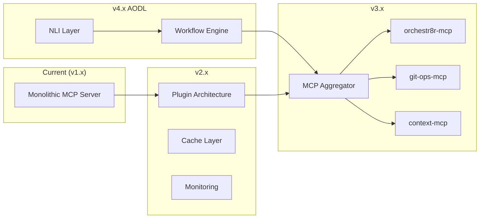

# Development Roadmap

## Current Status

orchestr8r-mcp v1.1.0 provides comprehensive GitHub Projects V2 management through 29 tools and 6 AI prompts. This roadmap outlines the path to v2.0 and beyond.

## Sprint Planning

### Sprint 1: Foundation (Current)
- [x] Add debugging support
- [x] Create first unit test  
- [x] Set up Project 10 with proper fields
- [x] Document existing functionality
- [ ] Implement dependency injection
- [ ] Modularize index.ts

### Sprint 2: Workflow APIs & Architecture
- [ ] Implement getCurrentSprint() - Get active sprint for workflow context
- [ ] Add caching layer - Redis L2 cache for GitHub API responses
- [ ] Create integration tests - Test suite for GraphQL operations
- [ ] Build recommendation engine - AI-powered task suggestions
- [ ] Migrate to TypeScript SDK McpServer pattern (8 pts)
- [ ] Implement plugin architecture (13 pts)
- [ ] Create MCP Aggregator for multi-server coordination (13 pts)

### Sprint 3: Service Architecture & Production
- [ ] Extract Git operations service (git-ops-mcp)
- [ ] Create context store - Persistent state management
- [ ] Build orchestration layer - Coordinate multiple MCP servers
- [ ] Implement service communication - Event-driven messaging
- [ ] Containerize with Docker
- [ ] Add comprehensive monitoring (Prometheus/Grafana)
- [ ] Implement OAuth 2.1 authentication
- [ ] Set up CI/CD pipeline

### Sprint 4: Intelligence & Advanced Features
- [ ] Build workflow engine - Automate complex processes
- [ ] Add natural language interface layer
- [ ] Implement predictive analytics
- [ ] Create IDE integrations
- [ ] Add team collaboration features

## Version Milestones

### v2.0 - TypeScript SDK Migration
**Target: End of Sprint 2**
- Clean architecture with McpServer pattern
- Plugin system for extensibility
- Performance improvements with caching
- Comprehensive test coverage

### v2.1 - Production Ready
**Target: End of Sprint 3**
- Docker deployment
- Full monitoring stack
- Security hardening
- Documentation complete

### v3.0 - Multi-Service Architecture
**Target: End of Sprint 4**
- MCP Aggregator coordinating multiple services
- Git operations integration
- State management with context store
- Event-driven architecture

### v4.0 - AODL Vision Complete
**Target: Q3 2024**
- Natural language interface
- AI-powered automation
- Predictive task management
- Full SDLC orchestration

## Technical Priorities

### Immediate (Sprint 1-2)
1. **Testing**: Achieve 80% code coverage
2. **Modularization**: Break down monolithic structure
3. **Performance**: Implement caching layer
4. **Documentation**: Complete API references

### Short-term (Sprint 3-4)
1. **Security**: OAuth implementation
2. **Scalability**: Kubernetes deployment
3. **Reliability**: Circuit breakers and retry logic
4. **Observability**: Distributed tracing

### Long-term (Beyond Sprint 4)
1. **Intelligence**: ML-based recommendations
2. **Integration**: IDE plugins
3. **Enterprise**: Multi-tenant support
4. **Analytics**: Advanced metrics and insights

## Architecture Evolution

## Success Metrics

### Performance
- API response time < 200ms (p95)
- Support 1000+ concurrent connections
- Cache hit rate > 80%

### Quality
- Test coverage > 80%
- Zero critical security vulnerabilities
- Error rate < 0.1%

### Adoption
- 100+ active installations
- 5+ contributor community
- Comprehensive documentation

## Contributing

See [CONTRIBUTING.md](/CONTRIBUTING.md) for how to help with these goals.

## Tracking Progress

Progress is tracked in [Project 10](https://github.com/users/lennylmiller/projects/10) with:
- Epics for major features
- Sprints for time-boxing
- Story points for estimation
- Regular retrospectives

For detailed task breakdowns, see the project board.